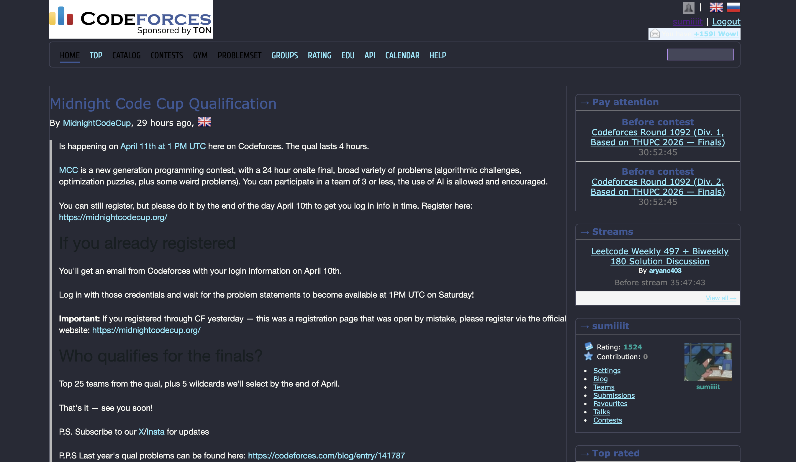

# 🏆 Codeforces Theme Pro

Enhance your Codeforces experience with a gallery of **50+ professional themes** inspired by VS Code, Atom, and other world-class IDEs. This extension is designed to reduce eye strain during long contests and provide a modern, aesthetic workspace for competitive programmers.

---

## 🎨 Themes Included
Choose from 50 unique palettes, including:
* **IDE Classics**: Dracula, Monokai, One Dark, Nord, GitHub Dark.
* **High-Contrast**: Pure Black (OLED), High Contrast, Matrix.
* **Soft & Nature**: Forest, Ocean, Everglade, Earthly.
* **Vibrant**: Cyberpunk, Synthwave '84, Neon, Lava.

## 📸 Screenshots
| **Dracula (Default)** | **One Dark** |
| :---: | :---: |
|  |  |

| **Monokai** | **Tokyo Night** |
| :---: | :---: |
|  |  |

---

## 🚀 Installation

### For Developers (Manual Load)
1. **Clone the Repo**:
   ```bash
   git clone [https://github.com/sumit0770/CF_Themes.git](https://github.com/sumit0770/CF_Themes.git)
